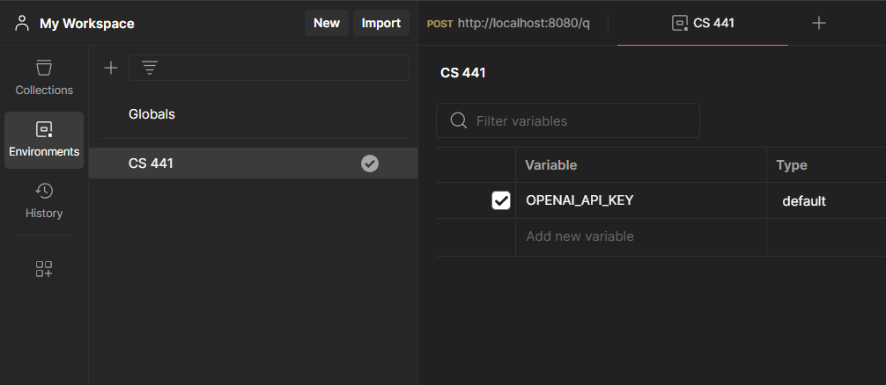
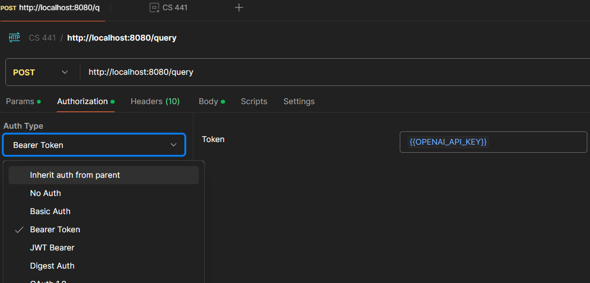
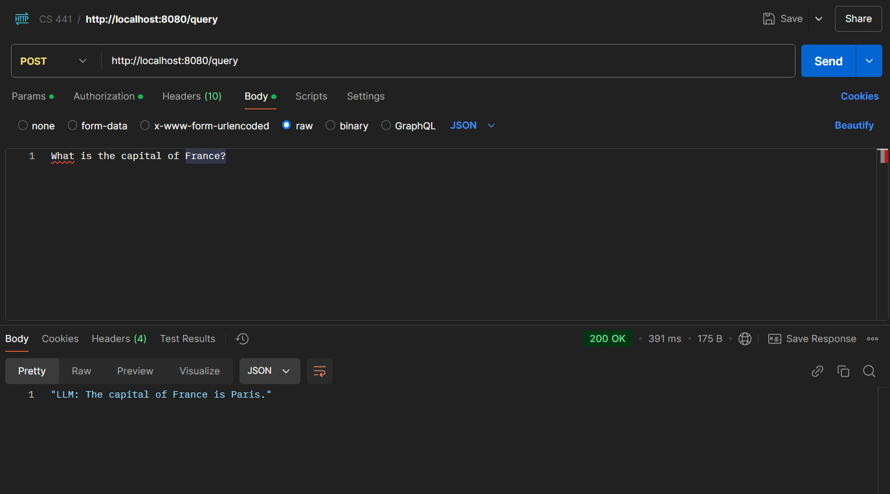

# LLM RESTful Microservice
### Name: Nikos Kotsopulos
### UIC Email: nkots2@uic.edu

## Project Overview
This project implements a RESTful microservice using Akka HTTP in Scala. 
The microservice interacts with a pre-trained Large Language Model (LLM) 
to process user queries and return generated responses. The service is 
deployed on an AWS EC2 and provides an endpoint to send queries via HTTP.

## Requirements
- SBT
- curl or Postman (for testing the API)
- OpenAI API Key

## Prerequisites
Before you begin, ensure that you have an OpenAI API Key to interact with the microservice. Here are the steps:
1. Create a Secret API key on OpenAI's [API key page](https://platform.openai.com/api-keys).
2. Store this key in a safe location, such as an environment variable.
3. Add this API key as a Bearer token in the request header for authentication.

Here is an example of using an OpenAI API Key in Postman:
1. Add the key to an environment.

2. Add as a bearer token under the `Authorization` section of your HTTP request.


## Setup Instructions

## Testing Locally
******************

### 1. Clone the Repository
Clone the project repository to your local machine:
```bash
git clone https://github.com/nikosdk3/llm-restful-microservice.git
```
### 2. Build the Project
Navigate to the project folder and build the project using SBT:
```bash
cd llm-restful-microservice
sbt compile
```

### 3. Run the Project Locally
```bash
sbt run
```
This will start the HTTP service on your local machine.

### 4. Test the API
From your local machine, use `curl` or Postman to send a POST request to the service.
Here is an example using Postman:

Send a POST request to the `/query` endpoint on `localhost:8080`.

## Using the microservice
Using the publicly available microservice is easier, as it doesn't require you to 
clone the project onto your local machine. Simply send a post request to the `/query`
endpoint on `52.91.2.250:8080`, similar to the last step in the previous section.

## Running the bash test scripts
In the root project directory, navigate to `src/test/scala` to find five bash scripts used for automated testing with pre-made requests.

Add your OpenAI API Key to each bash script and run them.

## Limitations
The text generation is limited to 20 words, meaning some responses will be cut off. This is intentional so that the OpenAI API usage is minimal to reduce costs.